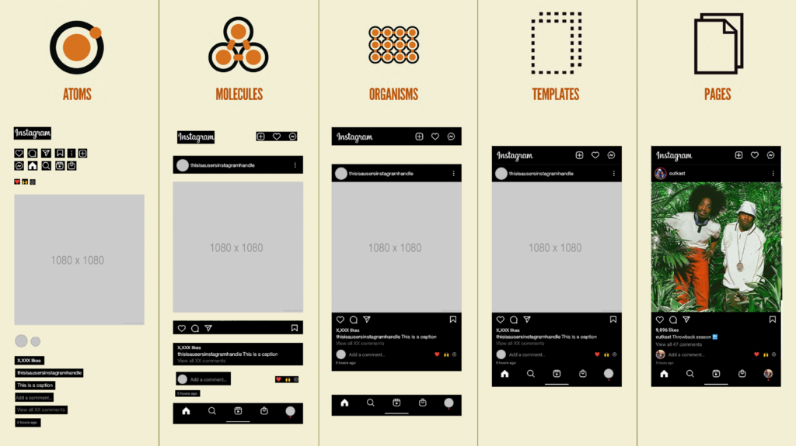

# Atomic Design

## O que é? 
É uma metodologia de criação de design systems desenvolvida por Brad Frost em 2013, que organiza interfaces de usuário em cinco níveis hierárquicos. Essa abordagem modular quebra componentes complexos em partes menores e reutilizáveis, garantindo consistência, escalabilidade e maior eficiência no desenvolvimento de produtos digitais. [Link do livro online do Brad Frost](https://atomicdesign.bradfrost.com/table-of-contents/)

### Praticando o Design atômico

O design atômico é composto por 5 níveis discretos: átomos, moléculas, organismos, templates e páginas.

### Pattern lab

É uma ferramenta de desenvolvimento front-end baseada em Atomic Design (design atômico) que auxilia na construção, visualização e teste de componentes de interface do usuário (UI). Ele funciona como uma biblioteca de padrões dinâmica, permitindo criar sistemas de design organizados de átomos a páginas completas, facilitando a consistência e a prototipagem rápida. [Link pagina Pattern Lab](https://patternlab.io)

